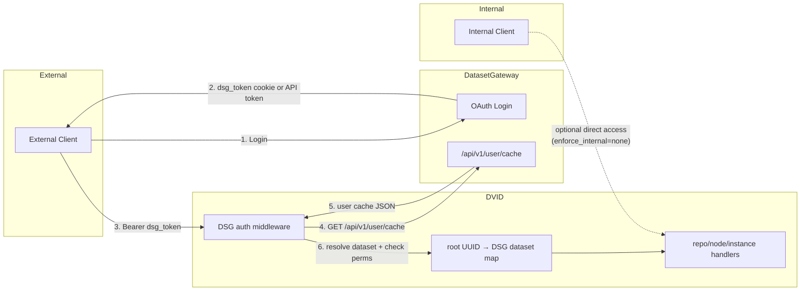

# DVID ↔ DatasetGateway Auth Integration

## Context

DVID servers running inside Janelia's network need authentication and dataset-scoped authorization for external clients while optionally allowing unauthenticated access for trusted internal clients. DatasetGateway (DSG) already provides the identity and permission model used by other services. DVID should align with that model directly instead of translating DSG tokens into DVID-issued JWTs.

This is a redesign, not a compatibility layer. DVID's existing auth code is lightly used, and current route activation only enables auth middleware when `proxy_address` is set. The DSG integration should therefore replace the old token-exchange model rather than extend it.

## How it works today

```
                    DVID auth flow (current)
                    ========================

Client ──Bearer JWT──► DVID
                        │
                  isAuthorized()
                        │
              ┌─────────┼─────────┐
              │         │         │
         enforce=none  token    authfile
         (pass all)  (valid JWT) (JWT user in auth_file)
```

- `serverTokenHandler` (`GET /api/server/token`) issues JWTs by either:
  - **Legacy proxy**: forwarding cookies to `https://{proxy_address}/profile`
  - **Google OAuth**: validating a Google ID token via `oauth2.Tokeninfo()`
- `isAuthorized` validates DVID JWTs on repo/node/instance routes
- those routes are currently wrapped only when `proxy_address` is configured
- `enforce` modes are `none`, `token`, and `authfile`

## Proposed design: DVID validates DSG tokens directly



### Core idea

Add a new `enforce` mode, `"dsg"`, with this behavior:

1. **Authentication**: DVID extracts the incoming DSG token from the request and validates it with DSG's `GET /api/v1/user/cache`.
2. **Authorization**: DVID resolves the request UUID to a DVID root UUID, maps that root UUID to a canonical DSG dataset ID, and checks the user's DSG permissions for that dataset.
3. **Internal/external split**: DVID can optionally bypass auth for trusted internal CIDRs via `enforce_internal = "none"`.

This matches the pattern already used by other DSG-integrated services: the client keeps using the DSG token, while each service applies its own dataset mapping and permission checks locally.

## Why direct DSG tokens are better for DVID

Using DSG tokens directly is simpler than issuing DVID JWTs from DSG tokens:

- no `/api/server/token` exchange step for clients
- no DVID JWT signing or verification logic
- no second bearer token format to document or debug
- no stale embedded permissions until DVID JWT expiry
- behavior aligns with `neuPrintHTTP`, `celltyping-light`, and `clio-store`

The main tradeoff is that DVID must contact DSG during authentication. In practice that should be handled with a short in-memory cache keyed by DSG token, not with a second JWT layer.

## Tradeoffs

### Direct DSG validation on every request

Advantages:
- permissions reflect DSG truth immediately after cache expiry
- no token translation layer
- fewer cryptographic and config concerns inside DVID

Disadvantages:
- requires a DSG network round-trip on cache miss
- adds dependency on DSG availability

### Cached DSG user info in DVID

Advantages:
- avoids a DSG call on every request
- keeps behavior close to direct validation
- much simpler than minting DVID JWTs

Disadvantages:
- permission changes are delayed until cache expiry
- revocation is only as fast as cache expiry

### DVID-issued JWTs derived from DSG tokens

Advantages:
- no DSG round-trip after token exchange

Disadvantages:
- second token format and issuance flow
- stale embedded permissions until JWT expiry
- extra signing and verification code in DVID
- more complex client workflow

For DVID, the recommended design is: **use DSG tokens directly, with a short in-memory cache of DSG user-cache responses**.

## Token transport and security

### Preferred token sources

For DVID, prefer these sources in order:

1. `Authorization: Bearer <dsg_token>`
2. `dsg_token` cookie
3. optional query parameter only if compatibility requires it

Headers are the best default for API clients. Cookies are useful for browser-based tools integrated with DSG SSO, but they are ambient credentials and require CSRF awareness. Query-parameter tokens are the weakest option because they tend to leak into logs, browser history, and proxies.

### Internal bypass

`internal_cidrs` plus `enforce_internal = "none"` is operationally useful but security-sensitive:

- only trust `X-Forwarded-For` behind a known proxy that rewrites it
- otherwise use `RemoteAddr`
- fail closed if client IP cannot be classified safely

### Dataset mapping

The local DVID identifier should be the **root UUID**, not repo alias. Root UUIDs are stable; aliases are mutable. The DSG-facing identifier should be an explicit mapped canonical dataset ID.

If a root UUID is not mapped, DVID should deny access rather than guess.

## Changes to DVID

### 1. Extend `authConfig`

```toml
[auth]
enforce = "dsg"
enforce_internal = "none"
dsg_address = "https://auth.example.org"
dsg_cache_ttl = 300
internal_cidrs = ["10.0.0.0/8", "172.16.0.0/12"]
dataset_map = {
  "a1b2c3d4e5f6..." = "vnc",
  "deadbeef1234..." = "manc"
}
public_versions = []
```

Suggested fields:

```go
type authConfig struct {
    PublicVersions  []string          `toml:"public_versions"`
    ProxyAddress    string            `toml:"proxy_address"` // legacy
    AuthFile        string            `toml:"auth_file"`     // legacy
    Enforce         string            `toml:"enforce"`
    NoEnforce       bool              `toml:"no_enforce"` // legacy

    EnforceInternal string            `toml:"enforce_internal"`
    DSGAddress      string            `toml:"dsg_address"`
    DSGCacheTTL     int               `toml:"dsg_cache_ttl"` // seconds
    InternalCIDRs   []string          `toml:"internal_cidrs"`
    DatasetMap      map[string]string `toml:"dataset_map"` // root UUID -> DSG dataset ID
}
```

Note: `authConfig` currently lives in `server/auth.go`.

### 2. Add DSG user-cache client

Create a small client in `server/auth.go` or a new auth helper file:

```go
type dsgUserCache struct {
    Email         string              `json:"email"`
    Name          string              `json:"name"`
    Admin         bool                `json:"admin"`
    Groups        []string            `json:"groups"`
    PermissionsV2 map[string][]string `json:"permissions_v2"`
    DatasetsAdmin []string            `json:"datasets_admin"`
}
```

Responsibilities:
- extract DSG token from request
- call `GET {dsg_address}/api/v1/user/cache`
- cache successful responses in memory for `dsg_cache_ttl`
- treat 401/403 as auth failure
- treat network errors as upstream auth-service failure

### 3. Add token extraction helper

Use the same practical ordering as other DSG services:

```go
func extractDSGToken(r *http.Request) string {
    // 1. Authorization: Bearer ...
    // 2. dsg_token cookie
    // 3. optional dsg_token query param, if enabled
}
```

For DVID, header-based auth should be the primary API path. Cookie support is reasonable for browser workflows. Query-param support should be omitted unless a real client needs it.

### 4. Add root-UUID → DSG dataset mapping helper

```go
func dsgDatasetForRequest(envUUID interface{}) (string, error) {
    // resolve request UUID -> root UUID
    // look up root UUID string in tc.Auth.DatasetMap
    // return DSG dataset ID or error
}
```

This is the DVID equivalent of the explicit `DatasetMap` used in other DSG-integrated services. The mapping should be authoritative.

### 5. Replace JWT-based `isAuthorized()` logic for `enforce = "dsg"`

For `enforce = "dsg"`:

- check public-version bypass first
- apply `effectiveEnforce()` for internal/external policy
- extract DSG token from the request
- fetch user cache from DSG or local token cache
- set `c.Env["user"]` from DSG email for logging compatibility
- if `user.Admin` is true, allow all requests
- resolve the mapped DSG dataset ID for the request
- require `view` for `GET`/`HEAD`/`OPTIONS`
- require `edit` for mutation methods
- deny on missing token, invalid token, missing dataset mapping, or insufficient permissions

This means `isAuthorized()` stops validating DVID JWTs for DSG mode and becomes DSG-backed authentication plus authorization middleware.

### 6. Route activation

`initRoutes()` in `server/web.go` should stop using `len(tc.Auth.ProxyAddress) != 0` as the switch for auth middleware. Route protection should be enabled whenever the effective auth mode requires it, including `enforce=token`, `enforce=authfile`, and `enforce=dsg`.

### 7. `/api/server/token`

Once DVID pivots fully to DSG tokens, `/api/server/token` is no longer part of the DSG design.

Options:

- leave it in place only for legacy proxy/Google modes
- deprecate it in docs
- eventually remove it entirely after DSG rollout

The DSG path should not depend on it.

## Changes to DatasetGateway

No DSG changes are required if `GET /api/v1/user/cache` remains the stable contract used by other services.

An optional future optimization would be a narrower access-check endpoint, but DVID does not need that for the initial design.

## Deployment example

```toml
[auth]
enforce = "dsg"
enforce_internal = "none"
dsg_address = "https://auth.janelia.org"
dsg_cache_ttl = 300
internal_cidrs = ["10.0.0.0/8", "172.16.0.0/12", "192.168.0.0/16"]
dataset_map = {
  "2f4a..." = "vnc",
  "7b91..." = "manc"
}
public_versions = ["abc123"]
```

## Client workflow

1. User authenticates with DSG and obtains a `dsg_token` cookie or API token.
2. Client sends the DSG token to DVID, preferably via `Authorization: Bearer`.
3. DVID validates the token with DSG's `/api/v1/user/cache`, using a short local cache on repeated requests.
4. DVID resolves the request UUID to a root UUID, maps that to a DSG dataset ID, and checks permissions.
5. DVID serves or rejects the request.

## What doesn't change

- DVID's route structure
- the `repoRawSelector -> isAuthorized -> handler` flow
- public version bypass logic
- blocklist functionality
- CORS handling

## Implementation order

1. **Add new `authConfig` fields** in `server/auth.go`
2. **Add DSG token extraction helper**
3. **Add DSG user-cache client with in-memory cache**
4. **Add root-UUID → DSG dataset mapping helper**
5. **Add `isInternalIP()` and `effectiveEnforce()`**
6. **Rewrite `isAuthorized()` for `enforce = "dsg"`**
7. **Update `initRoutes()`** to activate auth middleware by auth mode, not `proxy_address`
8. **Deprecate DSG use of `/api/server/token`** in docs and comments
9. **Update config example** in `scripts/distro-files/config-full.toml`

## Verification

1. **Unit test**: token extraction precedence
2. **Unit test**: root UUID → DSG dataset mapping, including missing mapping failures
3. **Unit test**: `isInternalIP()` with various CIDRs and IPs
4. **Unit test**: `effectiveEnforce()` for internal vs external requests
5. **Unit test**: permission checks for `view` vs `edit`
6. **Integration test**: mock DSG server, validate cache-hit and cache-miss behavior
7. **Integration test**: invalid DSG token returns auth failure
8. **Manual test**: browser workflow using `dsg_token` cookie
9. **Manual test**: API workflow using `Authorization: Bearer`
10. **Manual test**: internal IP bypass when `enforce_internal = "none"`

## Files to modify

| File | Change |
|------|--------|
| `server/auth.go` | `authConfig`, DSG token extraction, DSG user-cache client, root UUID → DSG dataset mapping helper, `effectiveEnforce()`, `isInternalIP()`, rewrite `isAuthorized()` for DSG mode |
| `server/server_local.go` | Optional: parse `internal_cidrs` into `[]*net.IPNet` at startup if we do not want lazy parsing in auth code |
| `server/web.go` | Update auth route activation so `enforce=dsg` is first-class |
| `scripts/distro-files/config-full.toml` | Add DSG config example and notes |
