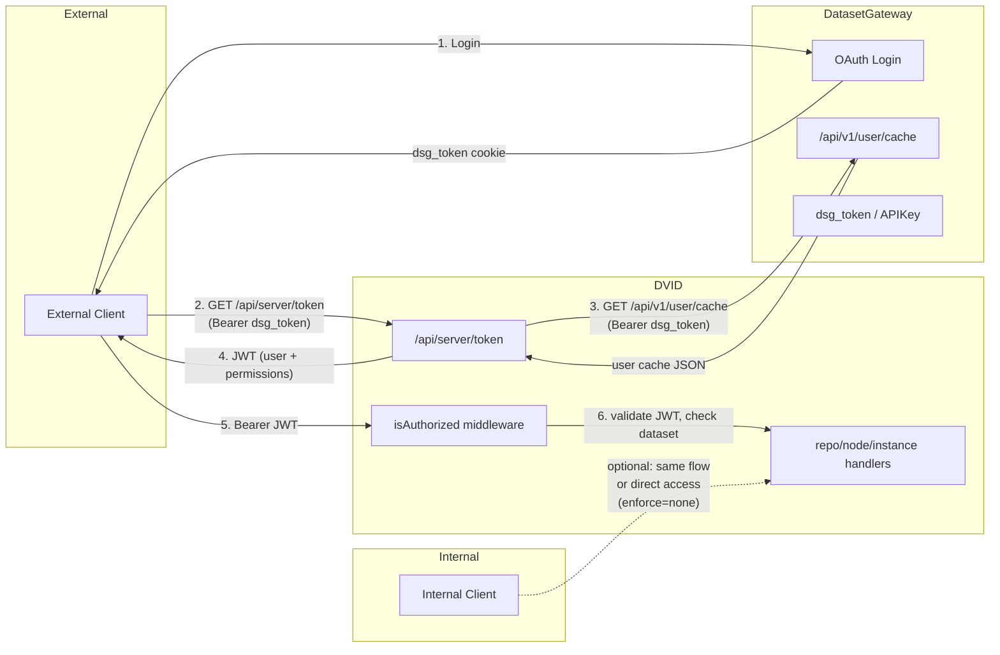

# DVID ↔ DatasetGateway Auth Integration

## Context

DVID servers running inside Janelia's network (DMZ or k8s nodes reachable externally) need to enforce authentication and authorization for external clients while optionally allowing unauthenticated access for internal clients. DatasetGateway already provides the auth stack (Google OAuth, dataset-scoped grants, TOS, permission cache). The goal is to connect DVID's existing auth middleware to DatasetGateway as the identity and authorization backend.

DVID already has part of the plumbing for this — its `[auth]` config section, the `isAuthorized` JWT middleware, and a `/api/server/token` endpoint that exchanges external credentials for a DVID JWT. However, the current route activation logic only turns on auth middleware when `proxy_address` is set, so DSG support is not just a backend swap. Route activation and JWT handling need to be updated as part of the work.

## How it works today

```
                    DVID auth flow (current)
                    ========================

Client ──Bearer JWT──► DVID
                        │
                  isAuthorized()
                        │
              ┌─────────┼─────────┐
              │         │         │
         enforce=none  token    authfile
         (pass all)  (valid JWT) (JWT user in auth_file)
```

- `serverTokenHandler` (`GET /api/server/token`) issues JWTs by either:
  - **Legacy proxy**: calling `getEmailFromProxy()` → forwards cookies to `https://{proxy_address}/profile` → gets email → signs JWT
  - **Google OAuth**: validating a Google ID token via `oauth2.Tokeninfo()` → gets email → signs JWT
- `isAuthorized` middleware validates `Authorization: Bearer {jwt}` on repo/node/instance routes, but those routes are currently wrapped only when `proxy_address` is configured
- `enforce` modes: `none` (open), `token` (any valid JWT), `authfile` (JWT user must be in a local JSON file)
- Public versions bypass auth for read-only requests

## Design: DSG as DVID's auth backend



### Core idea

Add a new `enforce` mode — `"dsg"` — to DVID's `authConfig` that integrates with DatasetGateway:

1. **Token issuance** (`/api/server/token`): Instead of calling a legacy proxy or Google directly, DVID calls DatasetGateway's `GET /api/v1/user/cache` with the client's `dsg_token` (passed as a Bearer token). DSG returns the user's identity + permissions. DVID embeds the email and permissions into a JWT and returns it.

2. **Authorization** (`isAuthorized` middleware): When `enforce = "dsg"`, after validating the JWT, DVID resolves the root UUID being accessed, maps that local DVID dataset identifier to a canonical DSG dataset ID, and checks the embedded permissions against the mapped DSG ID. This should be an explicit config mapping, not repo alias/name inference, because dataset naming is inconsistent across services and repo aliases are mutable.

3. **Internal/external split**: DVID's config gains an `internal_cidrs` list. Requests from internal IPs can optionally skip auth (`enforce_internal = "none"`) while external requests require DSG auth (`enforce = "dsg"`). This gives per-deployment control over internal access.

### Changes to DVID (Go)

#### 1. `server/auth.go` — Extend `authConfig`

```toml
[auth]
enforce = "dsg"                    # new mode: use DatasetGateway
enforce_internal = "none"          # optional: separate policy for internal IPs
dsg_address = "https://auth.example.org"  # DatasetGateway base URL
internal_cidrs = ["10.0.0.0/8", "172.16.0.0/12"]  # Janelia internal ranges
dataset_map = {                    # DVID root UUID -> DSG canonical dataset ID
  "a1b2c3d4e5f6..." = "vnc",
  "deadbeef1234..." = "manc"
}
public_versions = []               # unchanged: committed UUIDs with public access
```

New fields on `authConfig`:
```go
type authConfig struct {
    PublicVersions  []string `toml:"public_versions"`
    ProxyAddress    string   `toml:"proxy_address"`    // legacy, kept for compat
    AuthFile        string   `toml:"auth_file"`
    Enforce         string   `toml:"enforce"`          // "none", "token", "authfile", "dsg"
    NoEnforce       bool     `toml:"no_enforce"`       // legacy

    // New DSG fields
    EnforceInternal string   `toml:"enforce_internal"` // policy for internal IPs; defaults to Enforce
    DSGAddress      string   `toml:"dsg_address"`      // DatasetGateway base URL
    InternalCIDRs   []string          `toml:"internal_cidrs"` // CIDRs considered internal
    DatasetMap      map[string]string `toml:"dataset_map"`    // DVID root UUID -> DSG dataset ID
}
```

Note: `authConfig` currently lives in `server/auth.go`. `server/server_local.go` does not define the struct; it only carries it inside `tomlConfig`.

#### 2. `server/auth.go` — New `getDSGUserCache()` function

Calls `GET {dsg_address}/api/v1/user/cache` with the client's `dsg_token` as a Bearer token. Returns the parsed user cache (email, permissions map, admin flag).

```go
type dsgUserCache struct {
    Email         string              `json:"email"`
    Admin         bool                `json:"admin"`
    PermissionsV2 map[string][]string `json:"permissions_v2"`
}

func getDSGUserCache(dsgToken string) (*dsgUserCache, error) {
    // HTTP GET to tc.Auth.DSGAddress + "/api/v1/user/cache"
    // with Authorization: Bearer {dsgToken}
    // parse JSON response into dsgUserCache
}
```

#### 3. `server/auth.go` — Add dataset mapping helpers

Add a helper that resolves the root UUID for the request and then maps it to the DSG dataset ID:

```go
func dsgDatasetForRequest(envUUID interface{}) (string, error) {
    // resolve request UUID -> root UUID
    // look up root UUID string in tc.Auth.DatasetMap
    // return mapped DSG dataset ID
}
```

This is the DVID equivalent of the explicit `DatasetMap` used in `neuPrintHTTP`. The important point is that the auth check targets DSG's canonical dataset ID, not whatever local label a particular service happens to use.

#### 4. `server/auth.go` — Extend JWT generation/parsing to embed permissions

Currently JWTs only contain `user` (email). Add a `permissions` claim:

```go
claims["user"] = email
claims["permissions"] = permissionsV2  // map[string][]string from DSG
claims["admin"] = admin
claims["exp"] = time.Now().Add(24 * time.Hour).Unix()
```

Also add expiration (`exp`) claim — currently JWTs never expire, which is a security gap.

Important: DVID's current JWT code uses `jwt.SigningMethodRS512` while passing `[]byte(jwtSecretKey)` to signing and verification. This proposal should not preserve that ambiguity. As part of DSG support, JWT signing and verification should be normalized so the configured key type and signing method actually match.

#### 5. `server/auth.go` — Extend `serverTokenHandler()`

Add a `"dsg"` branch alongside the existing proxy and Google branches:

```go
func serverTokenHandler(w http.ResponseWriter, r *http.Request) {
    var email string
    if tc.Auth.Enforce == "dsg" {
        // Extract dsg_token from Authorization header
        dsgToken := extractBearerToken(r)
        if dsgToken == "" {
            BadRequest(w, r, "dsg_token required")
            return
        }
        cache, err := getDSGUserCache(dsgToken)
        if err != nil {
            BadRequest(w, r, "DSG auth failed: %v", err)
            return
        }
        email = cache.Email
        // Generate JWT with permissions embedded
        tokenString, err := generateJWTWithPermissions(email, cache.PermissionsV2, cache.Admin)
        // ...
    } else if len(tc.Auth.ProxyAddress) != 0 {
        // existing legacy proxy flow
    } else {
        // existing Google ID token flow
    }
}
```

#### 6. `server/auth.go` — Extend `isAuthorized()` middleware

For `enforce = "dsg"`:
- Parse JWT and extract `user`, `permissions`, `admin` claims
- If `admin` is true, allow all requests
- Resolve request UUID to root UUID, then map root UUID to DSG dataset ID via `tc.Auth.DatasetMap`
- Check if the mapped DSG dataset ID has at least `"view"` in the JWT permissions for GET/HEAD/OPTIONS, or `"edit"` for POST/PUT/DELETE
- For internal IPs (matched against `internal_cidrs`), apply `enforce_internal` policy instead

```go
func isAuthorized(c *web.C, h http.Handler) http.Handler {
    fn := func(w http.ResponseWriter, r *http.Request) {
        if isPublic(r, c.Env["uuid"]) {
            h.ServeHTTP(w, r)
            return
        }

        enforce := effectiveEnforce(r)  // checks IP against internal_cidrs
        switch enforce {
        case "none":
            h.ServeHTTP(w, r)
            return
        case "dsg":
            // parse JWT, extract permissions, check dataset access
        case "token":
            // existing: valid JWT is enough
        case "authfile":
            // existing: user must be in auth file
        }
    }
}

func effectiveEnforce(r *http.Request) string {
    if len(tc.Auth.InternalCIDRs) > 0 && isInternalIP(r) {
        if tc.Auth.EnforceInternal != "" {
            return strings.ToLower(tc.Auth.EnforceInternal)
        }
    }
    return strings.ToLower(tc.Auth.Enforce)
}
```

#### 7. `server/auth.go` — New `isInternalIP()` helper

Parses client IP from `RemoteAddr`, or from `X-Forwarded-For` only when DVID is known to sit behind a trusted proxy that rewrites it. Checks against parsed `internal_cidrs` (parsed once at startup into `[]*net.IPNet`). Trusting arbitrary `X-Forwarded-For` headers from the open internet would make the bypass spoofable.

### Changes to DatasetGateway (not this repo)

No code changes are required for the core DVID-side integration if DSG already exposes the expected identity/permission endpoint. However, one small addition would be useful:

#### Optional: `POST /api/v1/check-dvid-access` convenience endpoint

A lightweight endpoint optimized for DVID's use case that answers "can this user read/write dataset X?" in a single call, without the client needing to parse the full permission cache. This is optional — DVID can parse the existing `/api/v1/user/cache` response instead.

This could also just be the existing `POST /api/v1/check-access` endpoint, if its request/response shape is a good fit for DVID. That contract should be verified before DVID implementation starts.

### Deployment configuration

For a DVID server at Janelia serving multiple repos whose local identifiers do not necessarily match DSG naming:

```toml
# dvid.toml
[auth]
enforce = "dsg"
enforce_internal = "none"           # internal clients: no auth required
dsg_address = "https://auth.janelia.org"
internal_cidrs = ["10.0.0.0/8", "172.16.0.0/12", "192.168.0.0/16"]
dataset_map = {
  "2f4a..." = "vnc",
  "7b91..." = "manc"
}
public_versions = ["abc123"]        # specific committed UUIDs always public
```

Environment variable:
```
DVID_JWT_SECRET_KEY=<RSA private key for JWT signing>
```

### Client workflow

1. User logs into DatasetGateway via Google OAuth → gets `dsg_token` cookie
2. Client calls `GET dvid-server/api/server/token` with `Authorization: Bearer {dsg_token}`
3. DVID calls DSG's `/api/v1/user/cache` to validate the token and get permissions
4. DVID returns a JWT with the user's email and dataset permissions embedded
5. Client uses the JWT for all subsequent DVID API calls
6. DVID's `isAuthorized` middleware validates the JWT, resolves the request's root UUID, maps it to a DSG dataset ID, and checks permissions on each request

### What doesn't change

- DVID's route structure and middleware pipeline
- The `repoRawSelector` → `isAuthorized` → handler chain
- Public version bypass logic
- Blocklist functionality
- CORS handling

### Scope notes and follow-ups

- The right local identifier for DVID is the root UUID, not repo alias. Root UUIDs are stable; aliases are not.
- The DSG-facing identifier should be an explicit mapped value because different services can use incongruent dataset names for the same canonical dataset.
- A default normalization rule could be added later, but the config map should be authoritative.
- Embedding DSG permissions in a DVID JWT avoids a DSG round-trip on every request, but it also means permissions are cached until JWT expiry. Short-lived JWTs are therefore important.
- Returning `401` or `403` for auth failures would be preferable to the current `400`-style behavior, but that can be treated as a cleanup unless callers depend on the exact status codes.

## Implementation order

All changes are to the DVID repo (`server/auth.go` primarily):

1. **Add new `authConfig` fields** in `server/auth.go`
2. **Add root-UUID → DSG dataset mapping helper** — resolve request root and map to canonical DSG ID
3. **Add `isInternalIP()` and `effectiveEnforce()`** — IP classification logic
4. **Add `getDSGUserCache()`** — HTTP client to call DSG
5. **Extend `generateJWT()`** — embed permissions + expiry in JWT claims
6. **Extend `serverTokenHandler()`** — add `"dsg"` branch
7. **Extend `isAuthorized()`** — add `"dsg"` enforcement with mapped dataset permission checking
8. **Update `initRoutes()`** — make route auth depend on the effective auth mode, not only `proxy_address`
9. **Update config example** — `scripts/distro-files/config-full.toml`

## Verification

1. **Unit test**: `isInternalIP()` with various CIDRs and IPs
2. **Unit test**: JWT generation with permissions claims, verify parsing
3. **Unit test**: root UUID → DSG dataset mapping, including missing mapping failures
4. **Unit test**: `effectiveEnforce()` returns correct policy for internal vs external IPs
5. **Integration test**: Mock DSG server, verify token exchange flow end-to-end
6. **Manual test**: Deploy DVID with `enforce = "dsg"`, authenticate via DSG, verify mapped dataset access control
7. **Manual test**: Verify internal IP clients bypass auth when `enforce_internal = "none"`
8. **Manual test**: Verify external client without JWT gets 400/401 on repo/node/instance routes

## Files to modify

| File | Change |
|------|--------|
| `server/auth.go` | `authConfig` struct, root UUID → DSG dataset mapping helper, `getDSGUserCache()`, `effectiveEnforce()`, `isInternalIP()`, extend `generateJWT()`, extend `serverTokenHandler()`, extend `isAuthorized()` |
| `server/server_local.go` | Optional: parse `internal_cidrs` into `[]*net.IPNet` at startup in `Serve()` if we do not want lazy parsing in `server/auth.go` |
| `server/web.go` | Update `authorizationOn` condition so `enforce=token`, `enforce=authfile`, and `enforce=dsg` all activate auth middleware appropriately |
| `scripts/distro-files/config-full.toml` | Add `dsg` mode documentation and example fields |
